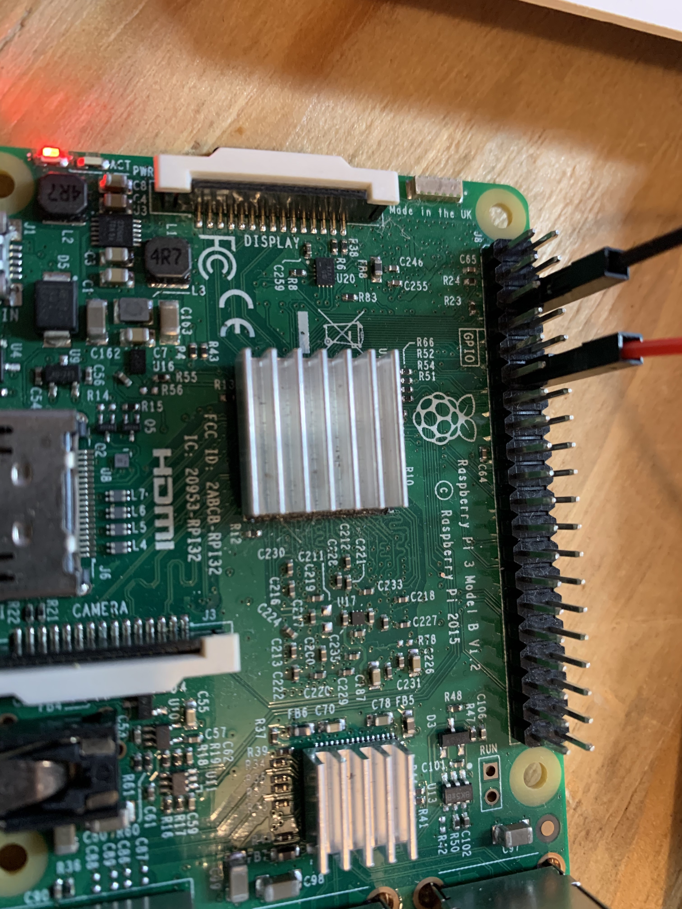
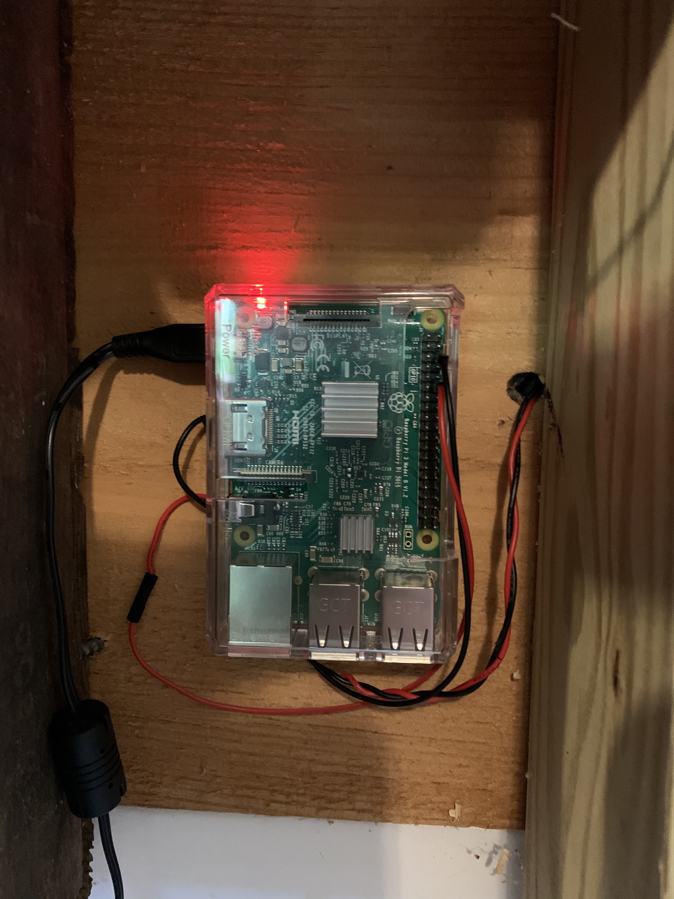
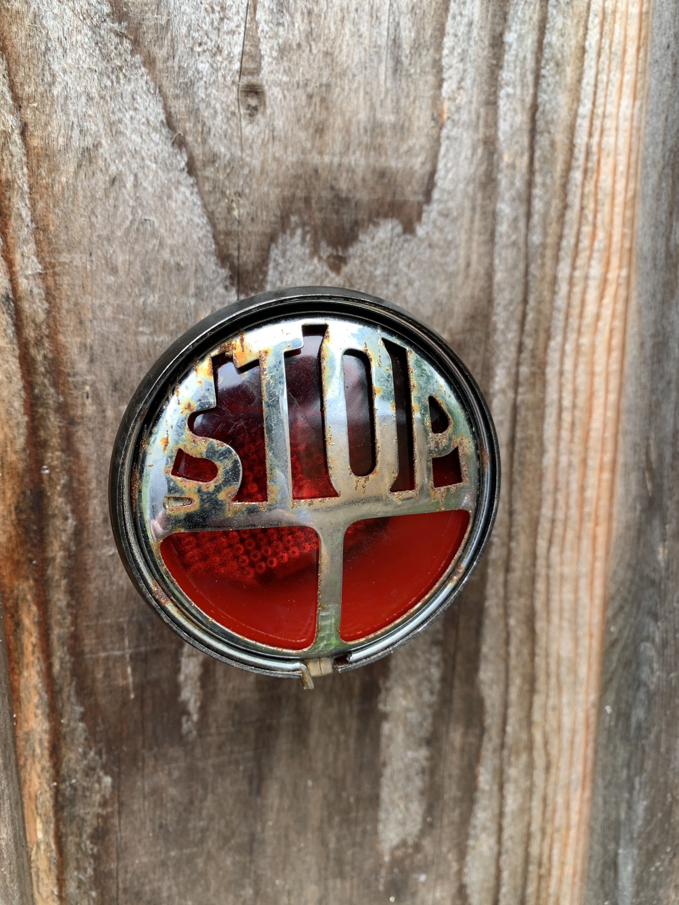
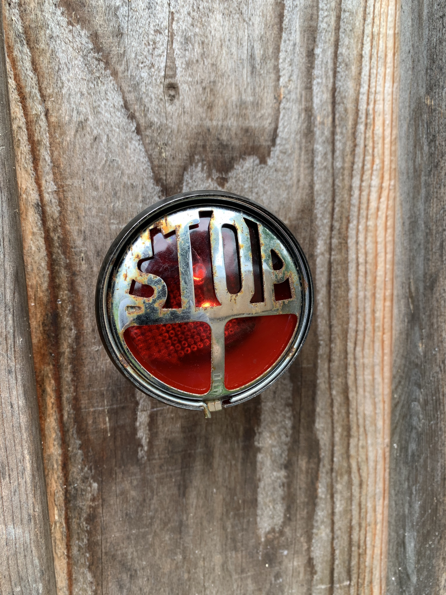

# slackstatuslight
This is a small project to connect two leds powered by a Pi to reflect status when I am in a meeting.

Here is the board pin outs to use for this.

Here is the board mounted to the wall and wired up

Here is the light off

And last but not least here is the light on

